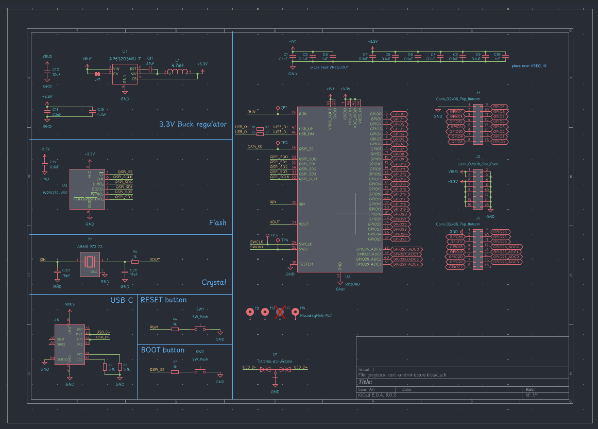
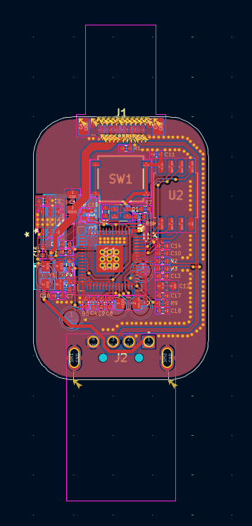
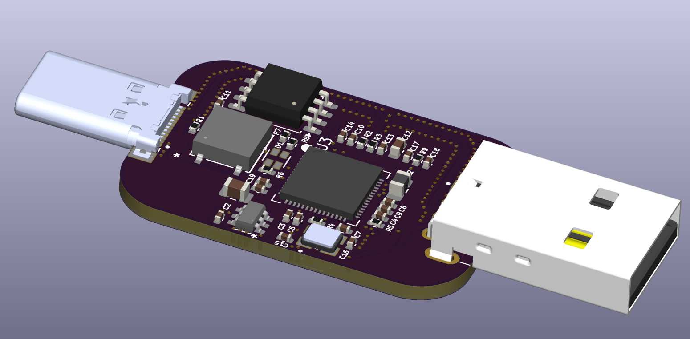

# Homemade Security Key with RP2350

the S in RP2350 stands for security :)

## Jul 30 | 14:00 - 21:00 | time to wire up the rp2350a

why did i choose the rp2350 you may ask? the rp2040 is designed to support secure environments when Secure Boot is enabled, and optionally, Secure Lock. These features allow a master key encryption key (MKEK) to be stored in a one-time programmable (OTP) memory region, which is inaccessible from outside secure code. This master key is then used to encrypt all private and secret keys on the device, protecting sensitive data from potential flash memory dumps.

even though the rp2350 is harder to wire up than the rp2040, it is worth it for the security features it provides. it also isnt that much harder to wire up too. you only need to add a few more components for the onboard regulator.

[https://datasheets.raspberrypi.com/rp2350/hardware-design-with-rp2350.pdf](https://datasheets.raspberrypi.com/rp2350/hardware-design-with-rp2350.pdf): a great resource for wiring up the rp2350

the rp2350b offers more GPIOs, but the rp2350a is sufficient for this project.

part list made: [https://www.digikey.ca/en/mylists/list/QRE80YFRXG](https://www.digikey.ca/en/mylists/list/QRE80YFRXG)

$38.92 total, not bad!

copying some stuff from my last rp2040 project hehe

Schematic is done!!!: [schematic](schematic.pdf)

pcb is done too!!!! gruesome 3 hours of work :pf:

okay i will just need to make a case for it and 3d print it
