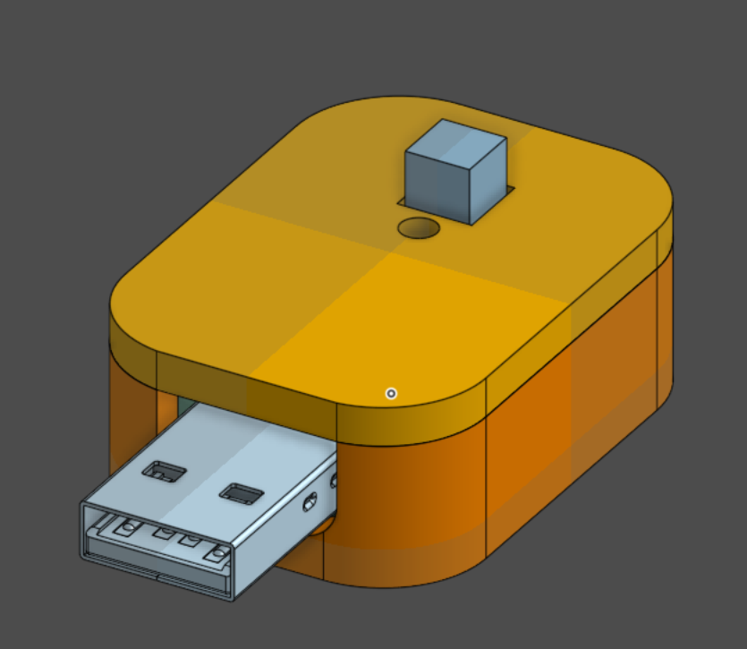
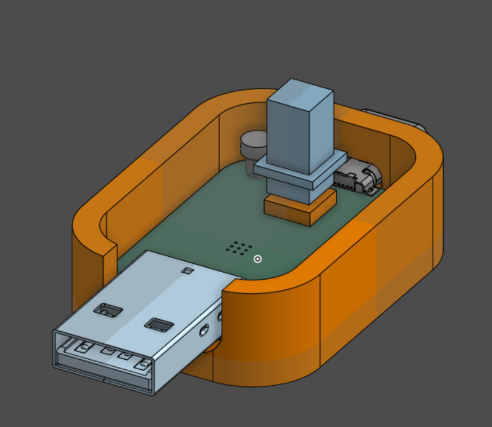

# homemade-security-key

DIY a security key! powered by a rp2350 for a pretty good security :D

with a nice 3d printed case and it is also easy to print, this key is hella nice for only 6$ each 🔥

the pcb is still well made tho, considerate thoughts have been put into the usb routing, and power delivery too!

## 3D Render

### PCB

### Case

