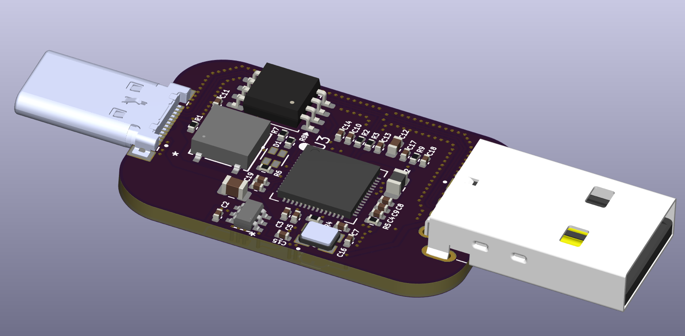

# homemade-security-key

DIY a security key! powered by a rp2350 for a pretty good security :D

with a nice 3d printed case and it is also easy to print, this key is hella nice for only 6$ each 🔥

the pcb is still well made tho, considerate thoughts have been put into the usb routing, and power delivery too!

## 3D Render

### PCB

### Case

| Type | Qty | Value |
| :--- | :-- | :--- |
| Capacitor | 1 | 10u |
| Capacitor | 10 | 100n |
| Capacitor | 1 | 1u |
| Capacitor | 1 | 22u |
| Capacitor | 4 | 4.7u |
| Capacitor | 2 | 18p |
| LED | 1 | B38G3RGB-10D0003H2U1930 |
| Connector | 1 | UP20-C-F-G-FL-1-P12-TR |
| Connector | 1 | UP2-AH-1-TH |
| Inductor | 1 | 4.7u |
| Inductor | 1 | AOTA-B201610S3R3-101-T |
| Resistor | 1 | 5.1k |
| Resistor | 2 | 27 |
| Resistor | 1 | 1k |
| Resistor | 1 | 10k |
| Resistor | 1 | 147 |
| Resistor | 3 | 33 |
| Button | 1 | PTS526SM15SMTR2 LFS |
| Buck regulator | 1 | AP63203WU-7 |
| Flash | 1 | W25Q16JVSS |
| MCU | 1 | RP2350A-QFN60 |
| Crystal | 1 | ABM8-272-T3 |
| PCB | 1 | |
| Stencil | 1 | |
| Solder paste | 1 | I already have |

---
**Total cost:** $64.78 USD
